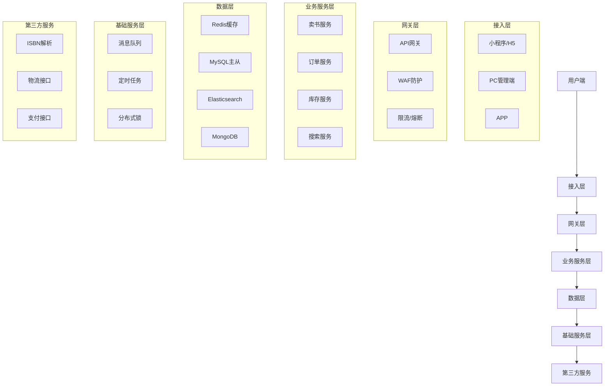

# 卖书系统架构图

```mermaid
graph TD
    A[用户端] --> B[接入层]
    B --> C[网关层]
    C --> D[业务服务层]
    D --> E[数据层]
    E --> F[基础服务层]
    F --> G[第三方服务]
    
    subgraph 接入层
        B1[小程序/H5]
        B2[PC管理端]
        B3[APP]
    end
    
    subgraph 网关层
        C1[API网关]
        C2[WAF防护]
        C3[限流/熔断]
    end
    
    subgraph 业务服务层
        D1[卖书服务]
        D2[订单服务]
        D3[库存服务]
        D4[搜索服务]
    end
    
    subgraph 数据层
        E1[Redis缓存]
        E2[MySQL主从]
        E3[Elasticsearch]
        E4[MongoDB]
    end
    
    subgraph 基础服务层
        F1[消息队列]
        F2[定时任务]
        F3[分布式锁]
    end
    
    subgraph 第三方服务
        G1[ISBN解析]
        G2[物流接口]
        G3[支付接口]
    end
```
